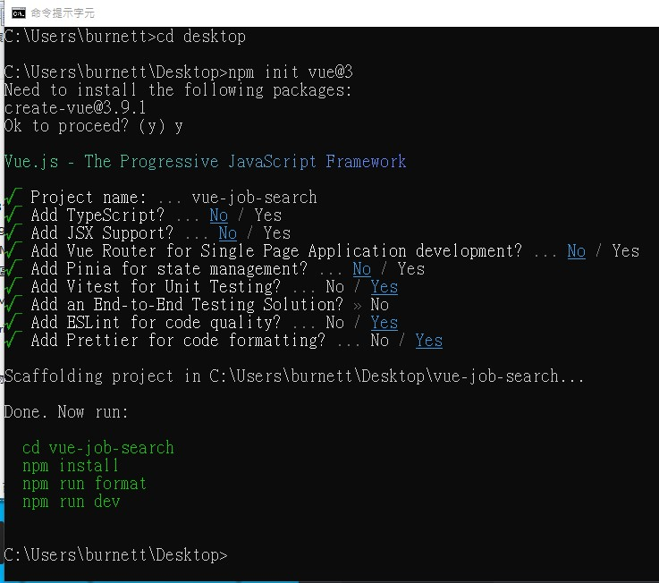

## 2-13 Use Create Vue to Initialize Vue Project

安裝連結參考

- [GitHub repository for Create Vue project](https://github.com/vuejs/create-vue)
- [Official website for Vite module bundler](https://vitejs.dev/guide/)

1. 在 Command Line 打入 npm init vue@3 或 npm create vue@latest

2. 以下設定為視情況選擇，再 run 以下綠色指令

3. 如本地伺服器無作用時可以重整網頁，或者在 vscode 的 Command Line 打入 ctrl + c 取消伺服器，在重新打入 npm run dev 即可重啟本地伺服器
