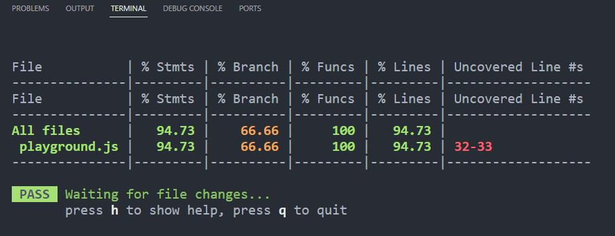
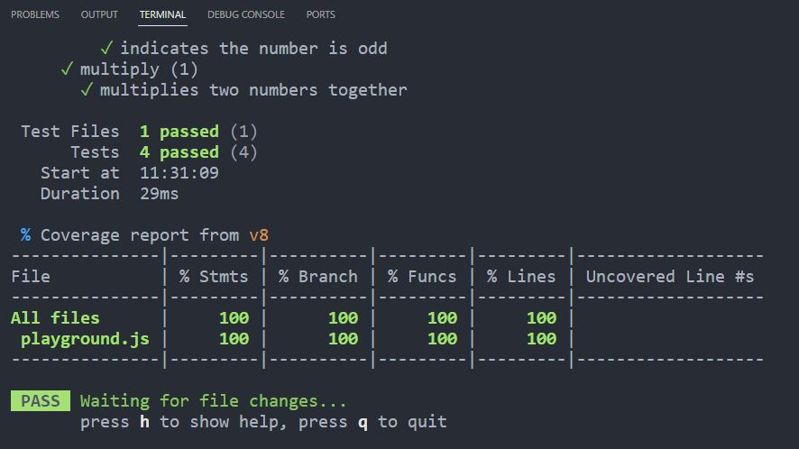

## 6-57 Adding the — coverage Flag

觀察 Test-Driven Development (TDD) 覆蓋率這樣就可以了解是否有哪些 code 並沒有用到

1. 於根目錄下 **package.json** -> **scripts** 加入下列程式碼，即可以在單元測試時產出 coverage report

```javascript
"scripts": {
    "test:unit": "vitest --environment jsdom --coverage",
  },
```

2. 根目錄下的 **test** folder -> **unit** folder， playground.test.js 下註解掉以下程式碼 (when number is odd)

```javascript
import { describe, it, expect } from 'vitest';

import { evenOrOdd } from '@/playground';

describe('basic math', () => {
  it('adds two numbers', () => {
    expect(1 + 1).toBe(2);
  });

  // 5-54 之前的測試碼
  describe('evenOrOdd', () => {
    describe('when number is even', () => {
      it('indicates the number is even'),
        () => {
          expect(evenOrOdd(4).toBe('Even'));
        };
    });

    // describe('when number is odd', () => {
    //   it('indicates the number is odd'),
    //     () => {
    //       expect(evenOrOdd(3).toBe('Odd'));
    //     };
    // });
  });

  // 6-56 增加 multiply
  describe('multiple', () => {
    it('multiplies two numbers together', () => {
      expect(multiply(2, 3)).toBe(6);
    });
  });
});
```

3. Terminal 輸入 npm run test:unit 即會出現下圖，因 playground.test.js 裡面的 evenOrOdd function 並沒有被完全使用到，因為上一步驟 playground.test.js 下註解掉以下程式碼 (when number is odd)



4. 同時也會在根目錄下產生一個 coverage folder 裡面的 index.html 點開即可看到所有 vitest 產出的所有東西並知道哪個部分並沒有被覆蓋到

5. playground.test.js 下解除註解掉以下程式碼 (when number is odd)，則會變成 100


