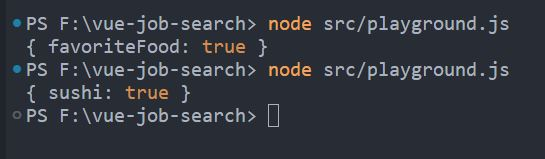

## 10-109~111 Adding a type Prop

如有多個 btn 需要 動態產出則可以使用 type 的方式 pass props

補充: Dynamic Object Keys

```javascript
const favoriteFood = 'sushi';

// const goodFoods = {
//   favoriteFood: true
// }

// 如加上[]，則會尋找 favoriteFood 裡的值
const goodFoods = {
  [favoriteFood]: true,
};

console.log(goodFoods);
```



1. 在根目錄 **components** folder -> MainNav.vue 的 component

```vue
<div class="ml-auto h-full flex items-center">
  <ProfileImage v-if="isLoggedIn" />
  <ActionButton v-else text="Sign in" type="primary" @click="loginUser" />
</div>
```

2. 在根目錄 **components** folder -> ActionButton.vue

```js
<template>
  <button :class="buttonClass">
    {{ text }}
  </button>
</template>

<script>
export default {
  name: 'ActionButton',
  props: ['text', 'type'],
  computed: {
    buttonClass() {
      return {
        // 方法 1
        // primary: this.type === 'primary',
        // secondary: this.type === 'secondary',
        // 方法 2 建議 (Dynamic Object Keys)
        [this.type]: true, // {primary: true} {secondary: true}
      };
    },
  },
};
</script>
```
